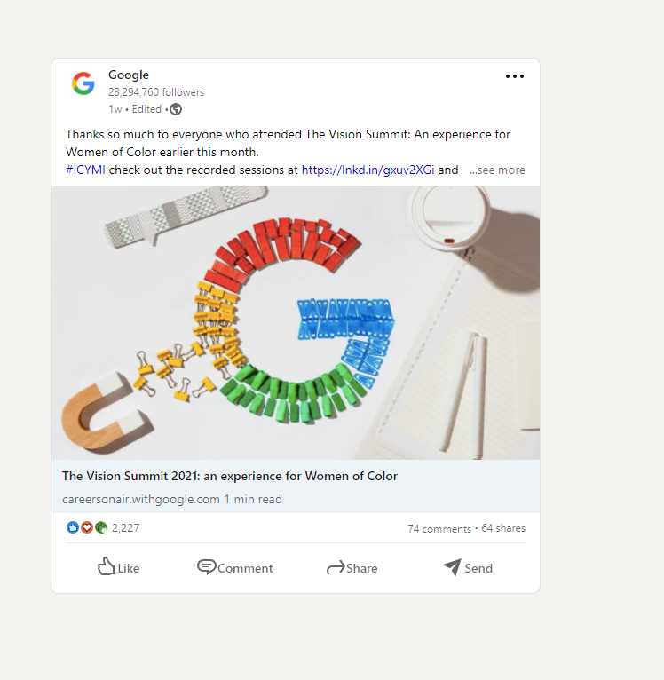

## Assignment-2 (Linkedin Post)
For this assigment, you need to prepare a Linkedin post.

### Evaluation Criterion
- You need to use class, id or attribute selector. Do not use inline styles.
- You need to use flexbox.
- Elements should be placed roughly as you see in the picture below.
- For bonus points, you need to give pay extra attention to the colors, border radius and fonts.

